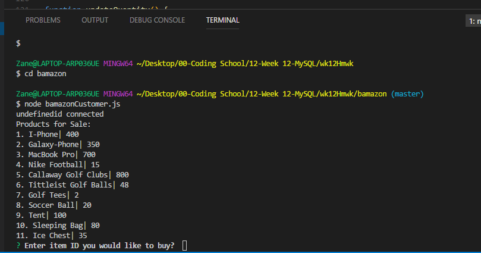

# bamazon

Project source can be downloaded from <a href="https://github.com/ztpence/bamazon">https://github.com/ztpence/bamazon

Author:
Zane Pence

Overview
This command line interface (CLI) app was developed as part of a software development course assignment. In this assignment, I created an Amazon-like store. The app will take in orders from customers and deplete stock from the store's inventory. 
After initiating the app, it will display all product names with their respective item IDs and prices. It then prompts the user to enter the ID of the product they wish to purchase.

  
